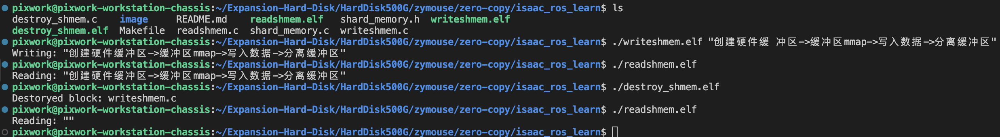

# nvidia加速硬件学习记录 - 进程间零拷贝

## 使用教程

### 使用方法
```shell
# 编译
make 

# 通过writeshmem.c文件名, 创建硬件缓冲区->缓冲区mmap->写入数据->分离缓冲区
./writeshmem.elf <input data>

# 通过writeshmem.c文件名, 加载缓冲区->>缓冲区mmap->读取数据->分离缓冲区
./readshmem.elf
# 通过writeshmem.c文件名, 加载缓冲区->消除缓冲区
./destroy_shmem.elf
```

### 执行效果
